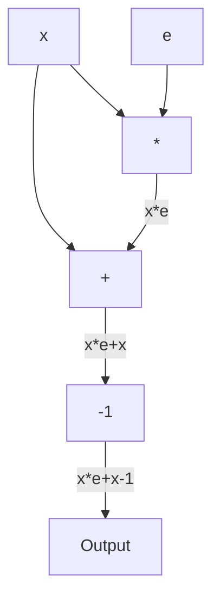

## Conceptos base de polinomios
### Polinomios en $\mathbb{F}_p$
Dados puntos $(x_1,y_1)...(x_n,y_n)$, existe un único polinomio $P$ de grado $n-1$ tal que 
$P(x_1)=y_1...P(x_n)=y_n$

### Lema de Schwartz-Zippel
Dados $P$ polinomio en $\mathbb{F}_p$ y $e$ un elemento elegido al azar (uniformemente), si $P(e)=0$, entonces con alta probabilidad $P=0$. La probabilidad es de hecho:
$Prob(P(e)=0)<\frac{n}{p}$

Dados $P$ y $Q$, puedo usar el lema con $P-Q$.

### Oráculos de Polinomios
Un oráculo es una caja negra que puede resolver un problema en una única operación. En nuestro caso, un oráculo de polinomio es tal que se le puede preguntar cuanto vale $P$ en $x$. No se le puede preguntar más nada sobre $P$ (grado, coeficientes, etc).

## Protocolo zk para Fibonacci

Claim: el elemento 9 de la serie vale 55. Como lo demuestro (sin rehacer la cuenta)?
Nos muestran serie
1 1 2 3 5 8 13 21 34 55
- A esta tira de elementos le decimos witness/traza.
- Esta es una traza válida.

### Setup
- $p$ primo
- $\mathbb{F}_p$ cuerpo finito
- $D=\{\omega^0,\omega^1,\dots,\omega^{n-1}\}$ subgrupo cíclico, con $\omega^n=1$
	- Entiendo que esto es así para tener $n$ puntos distintos donde interpolar el polinomio. El cuerpo entero tiene $p$ elementos, que es mayor a $n$.
	- Al ser cíclico, genera un subgrupo del cuerpo.
- $P$ prover, $V$ Verifier.

El prover toma la traza de Fibonacci que calculó, el dominio $D$ e interpola un polinomio $W(x)$ tal que
$W(\omega^0)=1$
$W(\omega^1)=1$
$W(\omega^2)=2$
...
$W(\omega^{n-1})=f_{n-1}$

El prover le manda un oráculo $[W]$ al verifier. Ya con el oráculo es posible probar la validez de la traza, pero es poco eficiente (tendría que preguntar una vez por elemento).

### Prover
Prover quiere probar que tiene una traza valida de ejecución de FIbonacci hasta $n$ (en este caso es orden del dominio, pero podría achicarse).

Condición de Fibonacci es $f_i+f_{i+1}-f_{i+2}=0$ para todo $i$. Traducido a traza esto es 
$W(\omega^i)+W(\omega^{i+1})-W(\omega^{i+2})=0$
$W(\omega^i)+W(\omega\omega^{i})-W(\omega^2\omega^{i})=0$

Dado $H(x,y,z)=x+y-z$, puedo definir $f(x)=H(W(x),W(y), W(z))$, que es
$f(x)=W(x)+W(\omega x)-W(\omega^2 x)$

Este es tal que
$f(\omega^i)=W(\omega^i)+W(\omega\omega^{i})-W(\omega^2\omega^{i})=0$

Es un polinomio que tiene una raíz en cada elemento del dominio.
Es decir, la traza es válida si y solo si $f(d)=0\,\forall \, d\in D$

Comentario: $f$ y $H$ son públicos.

Como f tiene raices en todos los puntos del dominio $D$ puedo factorizarlo como
$f(x)=(x-1)(x-\omega)(x-\omega^2)...(x-\omega^{n-1})t(x)$ para algún $t$
- $P$ calcula $t$ y manda $s$ oráculo a $V$
- Finaliza la parte del prover
- La prueba consiste de $[W]$ y $[t]$

(Fun fact: $(x-1)(x-\omega)(x-\omega^2)...(x-\omega^{n-1})=x^n-1$)

### Verifier
$V$ tiene oráculos $[W]$ y $[t]$, e info pública. Sortea un elemento $e$ al azar en $\mathbb{F}_p$, le pide a los oráculos los puntos $W(e)$ y $t(e)$.
Checkea la igualdad
$f(e)=(e^n-1)t(e)$
Donde $f(e)$ lo calculo haciendo 3 queries al oráculo para obtener $W(e)$, $W(\omega e)$, $W(\omega^2 e)$.

Si esta igualdad es válida, con alta probabilidad la factorización es válida, y por ende la traza es válida.

### Ejemplos
- Modelar un bit con restricciones polinomiales: $x.(1-x)=0$.
- Hacer un sistema de restricciones que haga un AND. Son las trazas que cumplen este conjunto de ecuaciones
  $\begin{cases}\begin{eqnarray}x.(1-x)&=&0\\ y.(1-y)&=&0\\ xy-z&=&0\end{eqnarray}\end{cases}$

## PLONK
Permutations over Lagrange-bases for Oecumenical Noninteractive arguments of Knowledge
Es un protocolo tipo SNARK. Sirve para demostrar una traza de un programa arbitrario. 
Plonky2 no es PLONK. PLONK no es una implementación, sino que tiene implementaciones. PLONK es una descripción del protocolo. Tampoco es una froma de transformar un programa arbitrario en un circuito. Es solo el proving system.

- Public input $x$
- Private input $e$
- Output $e*x+x-1$
Lo podemos pensar como un circuito, con 3 compuertas (multiplicación, suma, resta constante).

La traza (witness) es una matriz con los valores concretos que toma cada compuerta

Una traza válida de este programa es:

| A   | B   | C   |
| --- | --- | --- |
| 2   | 3   | 6   |
| 6   | 3   | 9   |
| 9   | -1  | 8   |

Defino una matriz Q, conocida por prover y verifier tal que tiene columnas $Q_L,Q_R,Q_M,Q_O,Q_C$ con la restricción
$Q_LA+Q_RB+Q_MAB+Q_OC+Q_C=0$
Cada término de $Q$ representa un input, output u operación. Acá $C$ es una columna de la traza y se usa para resultados intermedios de las operaciones y el output final.

Esto determina nuestro circuito, independientemente de los inputs.
Cada fila de la matriz representa una compuerta aritmética.

| $Q_L$ | $Q_R$ | $Q_M$ | $Q_O$ | $Q_C$ |
| ----- | ----- | ----- | ----- | ----- |
| 0     | 0     | 1     | -1    | 0     |
Si chequeamos con la primer fila de la traza

| A   | B   | C   |
| --- | --- | --- |
| 2   | 3   | 6   |
vemos que se cumple la restricción. 
Repetimos para las otras filas de la traza Se puede ver que también funciona para las otras filas.

| $Q_L$ | $Q_R$ | $Q_M$ | $Q_O$ | $Q_C$ |
| ----- | ----- | ----- | ----- | ----- |
| 0     | 0     | 1     | -1    | 0     |
| 1     | 1     | 0     | -1    | 0     |
| 1     | 0     | 0     | -1    | -1    |

Entonces la traza enter satisface la ecuación con estos valores de $Q$
Es posible encontrar otras trazas que satisfacen la misma ecuación con esta misma $Q$ pero que borran filas. En la próxima clase vamos a ver que restricción es necesaria para tener consistencia entre filas (argumento de permutación).

### Comprimir en vectores
Es posible comprimir todo el programa en una única fila (única compuerta). Si consideramos las columnas de la traza $A,B,C$ (vectores), podemos traducir la restricción original en $A.B+B-1-C=0$ y sacamos que $Q_L=0,Q_R=1,Q_M=1,Q_O=-1,Q_C=-1$

Privado: Traza
Público: Matriz $Q$ y cuerpo $\mathbb{F}_p$
### Interpolación
Traza es la matriz privada de $N=3$ columnas y $Q$ es la matriz pública con $M=5$ columnas. En total, tenemos 8 columnas. Interpolamos sobre el dominio $H$ las 8 columnas.

Reminder:

| A   | B   | C   |
| --- | --- | --- |
| 2   | 3   | 6   |
| 6   | 3   | 9   |
| 9   | -1  | 8   |

| $Q_L$ | $Q_R$ | $Q_M$ | $Q_O$ | $Q_C$ |
| ----- | ----- | ----- | ----- | ----- |
| 0     | 0     | 1     | -1    | 0     |
| 1     | 1     | 0     | -1    | 0     |
| 1     | 0     | 0     | -1    | -1    |

Interpolamos para obtener 8 polinomios $a,b,c,q_L,q_R,q_M,q_O,q_C$ tales que
$a(0)=2, a(1) =6, a(2)=9$. Recordemos que estamos en $\mathbb{F}_p$.

Para $p=11$, este polinomio es $a(x)=5x^2+10x+2$ 
Repetimos para cada columna vamos sacando cada polinomio.

### Un polinomio único
Definimos el polinomio $f$ como
$f=q_L\cdot a+q_L\cdot b+q_M\cdot a\cdot b +q_O\cdot c+q_C$

Nota: si los polinomios pequeños son de grado $N$, el polinomio $f$ es de a lo sumo grado $3*N$ por el término multiplicativo.

Esto es similar a la restricción original $Q_LA+Q_RB+Q_MAB+Q_OC+Q_C=0$

Entonces podemos decir que la traza es válida si evalua $f$ a 0. Es decir
$f(x)=q_L(x)\cdot a(x)+q_R(x)\cdot b(x)+q_M(x)\cdot a(x)\cdot b(x) +q_O(x)\cdot c(x)+q_C(x)$ y se da que $f(x)=0\;\forall\;x\in D$
donde $D$ es el dominio $D=\{\omega^i:\;0\leq i< N\}$ con $\omega$ un generador de $\mathbb{F}_p$ de orden $N$. 
__
$f(x)=0$ sii $x\in\{\omega^i:0\leq i<N\}$

Esto implica que
$(x-\omega^i)|f(x)$ (Nota: "|" es divide)
Y como vale para todo $i$, vale también. 
$\prod_{i=0}^{N-1}(x-\omega^i)|f(x)$

Podemos definir el polinomio
$\mathcal{z}_D=\prod_{i=0}^{N-1}(x-\omega^i)=x^n-1$
que divide a $f$. Por ende:
$\exists t:f=\mathcal{z}_D \cdot t$ 
Existe un $t$ que cumple con esta ecuación.

### Oráculos de polinomios
Llamamos $[a]$ al oráculo del polinomio $a(x)$. Nos permite evaluar el polinomio una vez y en un valor aleatorio. Llamamos $[a]_z$ al valor $a(z)$ que devuelve el oráculo.

Por el Schwartz-Zippel lema, en un cuerpo finito $\mathbb{F}_p$, dados dos polinomios $P$ y $Q$ de grado $n<<p$ y sus funciones asociadas $p,q:\mathbb{F}_p\rightarrow\mathbb{F}_p$, dado un valor aleatorio $z$ tomado de una distribución uniforme sobre $\mathbb{F}_p$, decimos que si $P(z)=Q(z)$ entonces con altísima probabilidad $P=Q$.

### Protocolo (parcial)

**Prover**
Le da al verifier los oráculos $[a],[b],[c]$ y $[t]$. 
Los términos $q_L,q_R,q_M,q_O$ y $q_C$ son públicos y los puede calcular el verifier por su cuenta (interpolando).

**Verifier**
Alcanza con hacer la verificación 
$q_L(z)[a]_Z+q_R(z)[b]_Z+q_M(z)[a]_Z[b]_Z+q_O(z)[c]_Z+q_C(z)=\mathcal{z}_D(z)[t]_Z$
en un punto random $z$, donde los términos en corchetes son preguntados al oráculo y los otros calculados.

### Notas

PLONK no explica como resolver las matrices y las trazas, solo se ocupa de la prueba.

Prover:
- Interpolación de las trazas
- División de polinomios

Verifier:
- Cuentas en $\mathbb{F}_p$

Oráculos
- Caja negra por ahora, pero va a tener mucha complejidad.

**Public inputs**
Necesitamos una forma de demostrar que el programa se ejecutó con ciertos valores públicos. Los putputs son valores públicos. Los inputs estan metidos en la traza.

Se pueden agregar public inputs a PLONK, actualizando la restricción como
$Q_LA+Q_RB+Q_MAB+Q_OC+Q_C+Q_{PI}=0$

## Lagrange interpolation
Dado un conjunto de $N+1$ puntos $(x_0,y_0),(x_1,y_1),\dots(x_n,y_n)$ el objetivo es encontrar un polinomio $P(x)$ tal que $P(x_i)=y_i\;\forall i$

Lagrange dice que 
$P(x)=\sum_{i=0}^Ny_i.l_i(x)$
donde $l_i(x)$ es la base de polinomios de Lagrange dada por
$l_i(x)=\prod_{0\leq j\leq n,j\neq i}\frac{x-x_j}{x_i-x_j}$

